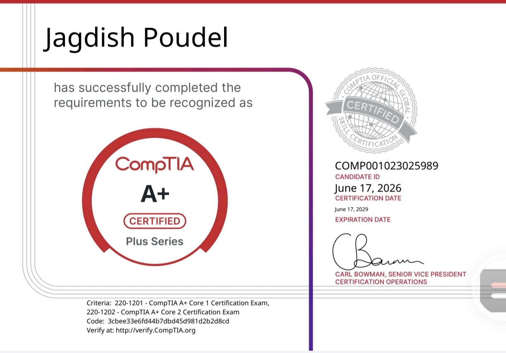

# CompTIA A+ Notes

Personal study notes, troubleshooting references, and practical learning materials created while preparing for the CompTIA A+ certification.

---

## About

This repository contains my personal notes for the CompTIA A+ certification. The notes follow the official CompTIA exam objectives and were created to reinforce learning through structured note-taking, revision, and hands-on practice.

---

## Certification Status

🏆 **CompTIA A+ Certified**

* Core 1 (220-1201) Passed
* Core 2 (220-1202) Passed
* Certification Date: June 17, 2026
* Valid Through: June 17, 2029

---

## Repository Structure

### Core 1 Notes

* [Domain 1 - Mobile Devices](./Core1Notes/Domain-1)
* [Domain 2 - Networking](./Core1Notes/Domain-2)
* [Domain 3 - Hardware](./Core1Notes/Domain-3)
* [Domain 4 - Virtualization and Cloud Computing](./Core1Notes/Domain-4)
* [Domain 5 - Hardware and Network Troubleshooting](./Core1Notes/Domain-5)

### Core 2 Notes

* [Domain 1 - Operating Systems](./Core2Notes/Domain-1)
* [Domain 2 - Security](./Core2Notes/Domain-2)
* [Domain 3 - Software Troubleshooting](./Core2Notes/Domain-3)
* [Domain 4 - Operational Procedures](./Core2Notes/Domain-4)

---

## Objectives

This repository was created to:

* Study CompTIA A+ objectives in a structured manner
* Build strong IT support fundamentals
* Improve troubleshooting methodology
* Create a personal technical knowledge base
* Document the certification journey
* Prepare for future certifications and technologies

### Future Learning Path

* CCNA
* Security+
* Python Automation
* Linux Administration
* Infrastructure & Operations
* Cyber Security

---

## Certificate

Certification image:

```text
images/comptia-a-plus-certificate.jpg
```

After uploading the certificate image, uncomment and update the path if necessary:





---

## Progress

This repository will continue to grow with:

* Updated notes
* Troubleshooting examples
* Lab exercises
* Additional learning resources
* Practical IT knowledge gained through study and experience

---

## Author

**Jagdish Poudel**

CompTIA A+ Certified | Aspiring Infrastructure & Network Professional
